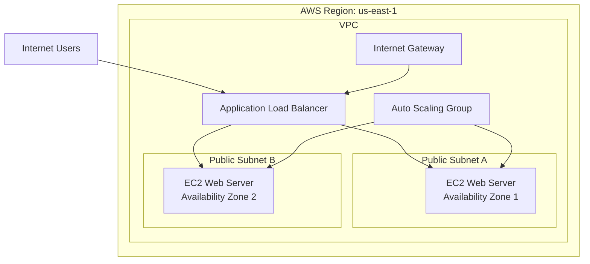

# Highly Available AWS Web Architecture with Terraform

## Project Overview

This project demonstrates the deployment of a highly available web application infrastructure in Amazon Web Services using Terraform Infrastructure as Code.

The architecture uses an Application Load Balancer to distribute incoming web traffic across Amazon EC2 instances running in two Availability Zones. The EC2 instances are managed by an Auto Scaling Group, allowing the environment to maintain availability, replace unhealthy instances, and scale when demand changes.

The web servers run Amazon Linux 2023 with Apache installed automatically through an EC2 user data script. The entire environment was provisioned, tested, documented, and destroyed using Terraform.

## Project Goals

* Build AWS infrastructure using Terraform
* Deploy resources across multiple Availability Zones
* Configure a custom VPC and public subnets
* Distribute traffic through an Application Load Balancer
* Maintain EC2 capacity with an Auto Scaling Group
* Apply security groups to control network traffic
* Automate web-server installation and configuration
* Document and verify the deployed environment
* Destroy resources after testing to control cloud costs
## Architecture

The infrastructure was deployed in the `us-east-1` AWS Region. Two public subnets were created in separate Availability Zones to improve availability. An internet-facing Application Load Balancer distributed HTTP traffic across EC2 web servers managed by an Auto Scaling Group.

## AWS Services Used

| AWS Service                         | Purpose                                                                                |
| ----------------------------------- | -------------------------------------------------------------------------------------- |
| Amazon VPC                          | Provided an isolated virtual network for the project                                   |
| Public Subnets                      | Hosted resources across two Availability Zones                                         |
| Internet Gateway                    | Connected the VPC to the internet                                                      |
| Route Tables                        | Directed public internet traffic through the Internet Gateway                          |
| Amazon EC2                          | Hosted the Apache web servers                                                          |
| EC2 Launch Template                 | Defined the instance type, operating system, security group, and startup configuration |
| EC2 Auto Scaling                    | Maintained the desired number of web servers and replaced unhealthy instances          |
| Application Load Balancer           | Distributed HTTP traffic across healthy EC2 instances                                  |
| Target Group                        | Registered EC2 instances and performed health checks                                   |
| Security Groups                     | Controlled inbound and outbound network traffic                                        |
| AWS Systems Manager Parameter Store | Supplied the current Amazon Linux 2023 AMI                                             |
| AWS CLI                             | Connected the local development environment to AWS                                     |
| Terraform                           | Provisioned and removed the AWS infrastructure as code                                 |

## High Availability Design

The project improves availability by deploying resources across two Availability Zones. If one web server becomes unhealthy, the Application Load Balancer stops routing traffic to it. The Auto Scaling Group can replace unhealthy instances and maintain the desired capacity.

This design demonstrates:

* Multi-AZ deployment
* Load balancing
* Health checks
* Automated instance replacement
* Scalability
* Fault tolerance
* Infrastructure as Code

