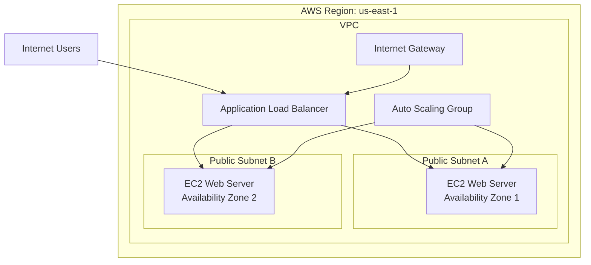
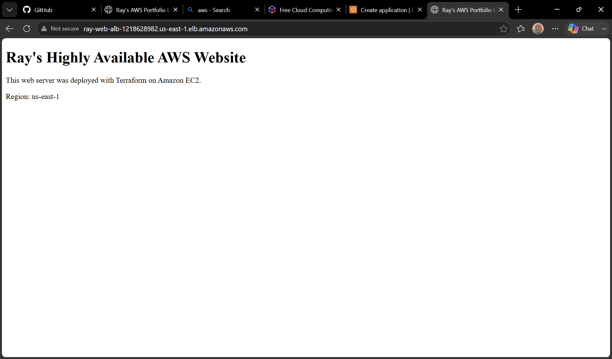

# Highly Available AWS Web Architecture with Terraform

## Project Overview

This project demonstrates the deployment of a highly available web application infrastructure in Amazon Web Services using Terraform Infrastructure as Code.

The architecture uses an Application Load Balancer to distribute incoming web traffic across Amazon EC2 instances running in two Availability Zones. The EC2 instances are managed by an Auto Scaling Group, allowing the environment to maintain availability, replace unhealthy instances, and scale when demand changes.

The web servers run Amazon Linux 2023 with Apache installed automatically through an EC2 user data script. The entire environment was provisioned, tested, documented, and destroyed using Terraform.

## Project Goals

* Build AWS infrastructure using Terraform
* Deploy resources across multiple Availability Zones
* Configure a custom VPC and public subnets
* Distribute traffic through an Application Load Balancer
* Maintain EC2 capacity with an Auto Scaling Group
* Apply security groups to control network traffic
* Automate web-server installation and configuration
* Document and verify the deployed environment
* Destroy resources after testing to control cloud costs
## Architecture



The infrastructure was deployed in the `us-east-1` AWS Region. Two public subnets were created in separate Availability Zones to improve availability. An internet-facing Application Load Balancer distributed HTTP traffic across EC2 web servers managed by an Auto Scaling Group.

## AWS Services Used

| AWS Service                         | Purpose                                                                                |
| ----------------------------------- | -------------------------------------------------------------------------------------- |
| Amazon VPC                          | Provided an isolated virtual network for the project                                   |
| Public Subnets                      | Hosted resources across two Availability Zones                                         |
| Internet Gateway                    | Connected the VPC to the internet                                                      |
| Route Tables                        | Directed public internet traffic through the Internet Gateway                          |
| Amazon EC2                          | Hosted the Apache web servers                                                          |
| EC2 Launch Template                 | Defined the instance type, operating system, security group, and startup configuration |
| EC2 Auto Scaling                    | Maintained the desired number of web servers and replaced unhealthy instances          |
| Application Load Balancer           | Distributed HTTP traffic across healthy EC2 instances                                  |
| Target Group                        | Registered EC2 instances and performed health checks                                   |
| Security Groups                     | Controlled inbound and outbound network traffic                                        |
| AWS Systems Manager Parameter Store | Supplied the current Amazon Linux 2023 AMI                                             |
| AWS CLI                             | Connected the local development environment to AWS                                     |
| Terraform                           | Provisioned and removed the AWS infrastructure as code                                 |

## High Availability Design

The project improves availability by deploying resources across two Availability Zones. If one web server becomes unhealthy, the Application Load Balancer stops routing traffic to it. The Auto Scaling Group can replace unhealthy instances and maintain the desired capacity.

This design demonstrates:

* Multi-AZ deployment
* Load balancing
* Health checks
* Automated instance replacement
* Scalability
* Fault tolerance
* Infrastructure as Code
## Deployment Evidence

### Live Website

The Terraform configuration successfully deployed an Apache web server behind the Application Load Balancer.



### Auto Scaling Group

The Auto Scaling Group maintained the required number of EC2 web servers across multiple Availability Zones.


### Load Balancer and Healthy Targets

The Application Load Balancer distributed traffic to healthy EC2 targets.


### Security Groups

Security groups controlled network access between internet users, the Application Load Balancer, and the EC2 web servers.


### Service Health

AWS service status and deployed-resource health were reviewed to confirm the environment was operating correctly.


## Terraform Workflow

The following Terraform workflow was used:

```bash
terraform fmt
terraform init
terraform validate
terraform plan
terraform apply
terraform output
terraform destroy
```

### Command Purposes

| Command              | Purpose                                         |
| -------------------- | ----------------------------------------------- |
| `terraform fmt`      | Formats Terraform configuration files           |
| `terraform init`     | Initializes the project and downloads providers |
| `terraform validate` | Checks whether the configuration is valid       |
| `terraform plan`     | Previews the resources Terraform will create    |
| `terraform apply`    | Deploys the AWS infrastructure                  |
| `terraform output`   | Displays important deployment information       |
| `terraform destroy`  | Removes the deployed resources to control costs |

## Security Controls

The project included the following security practices:

* AWS root credentials were not stored in the repository
* AWS CLI browser authentication was used instead of embedding access keys
* Terraform state files were excluded through `.gitignore`
* The EC2 security group accepted HTTP traffic only from the load balancer security group
* The load balancer accepted public HTTP traffic on port 80
* SSH access was not opened to the internet
* Project resources were tagged for identification and cleanup
* Resources were destroyed after testing to prevent unnecessary charges
## Prerequisites

To deploy this project, the following tools and accounts are required:

* AWS account
* AWS CLI version 2
* Terraform
* Git
* Visual Studio Code or another code editor
* AWS permissions to create VPC, EC2, Auto Scaling, and Elastic Load Balancing resources

## Deployment Instructions

### 1. Clone the repository

```bash
git clone https://github.com/RayHackz101/aws-high-availability-lab.git
cd aws-high-availability-lab
```

### 2. Configure AWS authentication

Sign in through the AWS CLI using a secure authentication method:

```bash
aws login
```

Verify the connected AWS identity:

```bash
aws sts get-caller-identity
```

Never store AWS passwords, access keys, or secret keys inside Terraform files or the GitHub repository.

### 3. Create a local variables file

Copy the example variable file:

```powershell
Copy-Item terraform.tfvars.example terraform.tfvars
```

The default configuration deploys resources in:

```text
us-east-1
```

### 4. Initialize Terraform

```bash
terraform init
```

### 5. Format and validate the configuration

```bash
terraform fmt
terraform validate
```

### 6. Preview the infrastructure

```bash
terraform plan
```

Review all proposed resources before continuing.

### 7. Deploy the infrastructure

```bash
terraform apply
```

Type `yes` when Terraform requests confirmation.

After deployment, Terraform displays the Application Load Balancer DNS name and website URL.

### 8. View the outputs

```bash
terraform output
```

Open the value shown for `website_url` in a web browser.

## Resource Cleanup

This project creates resources that may produce AWS charges, including EC2 instances and an Application Load Balancer.

After completing testing and documentation, remove the infrastructure:

```bash
terraform destroy
```

Type `yes` when prompted.

The live resources used for this project were destroyed after testing, while the Terraform code and deployment screenshots were retained for documentation.

## Repository Structure

```text
aws-high-availability-lab/
├── images/
│   ├── auto scaling Running.png
│   ├── deployed-website.png
│   ├── load balancer healthy.png
│   ├── security groups.png
│   └── service health.png
├── .gitignore
├── .terraform.lock.hcl
├── main.tf
├── outputs.tf
├── providers.tf
├── README.md
├── terraform.tfvars.example
└── variables.tf
```

## Skills Demonstrated

* Amazon Web Services
* Terraform Infrastructure as Code
* Amazon EC2
* Application Load Balancing
* EC2 Auto Scaling
* Amazon VPC networking
* Multi-Availability Zone architecture
* Security group configuration
* Linux web-server automation
* AWS CLI authentication
* Git and GitHub
* Infrastructure validation and troubleshooting
* Cloud cost management
* Technical documentation

## Lessons Learned

Through this project, I learned how Terraform can be used to define, deploy, and remove an AWS environment in a repeatable way. I also gained hands-on experience connecting network resources, configuring security groups, deploying EC2 instances, distributing traffic through a load balancer, and maintaining capacity through Auto Scaling.

The project reinforced the difference between AWS Regions and Availability Zones, how Multi-AZ deployments improve availability, and how the shared responsibility model applies to Infrastructure as a Service. AWS managed the physical infrastructure, while I configured the virtual network, operating system, application software, traffic rules, and resource cleanup.

I also learned the importance of reviewing Terraform plans, protecting state files, verifying deployed resources in the AWS Console, documenting evidence, and destroying temporary resources after testing.

## Résumé Project Summary

**Highly Available AWS Web Architecture — Terraform**

Designed and deployed a highly available AWS web environment using Terraform, including a custom VPC, public subnets across two Availability Zones, EC2 Auto Scaling, an Application Load Balancer, target-group health checks, security groups, and automated Apache installation. Validated the live deployment, documented AWS Console evidence, managed the project through Git and GitHub, and destroyed cloud resources after testing to control costs.

## Project Status

**Completed**

The infrastructure was successfully deployed, tested, documented, uploaded to GitHub, and destroyed after verification.

